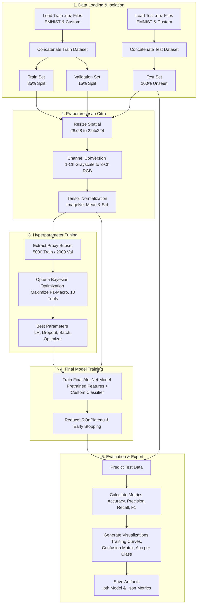

# Dokumentasi Pipeline AlexNet + Bayesian Optimization

Dokumen ini menguraikan arsitektur sistem, strategi pemrosesan data, desain model _Deep Learning_, hingga evaluasi akhir untuk **Klasifikasi Alfabet Huruf Kecil (a-z)**. Pendekatan komputasional yang diterapkan menggunakan arsitektur **AlexNet berbasis Transfer Learning (Pretrained)** yang dikalibrasi secara probabilistik menggunakan **Bayesian Optimization**.

---

## Diagram Pipeline

Berikut adalah representasi visual dari arsitektur aliran data (_data flow_) dari tahap input mentah hingga ekstraksi metrik evaluasi:



---

## Ringkasan Dataset & Strategi Penggabungan

Model ini dilatih menggunakan gabungan dua representasi data: dataset standar **EMNIST Lowercase** (yang telah diseimbangkan) dan **Dataset Custom Abjad**.

diimplementasikan dengan memisahkan array file sumber untuk partisi `train` dan `test` secara mutlak sejak inisialisasi memori. Pemisahan sekunder untuk _monitoring_ pelatihan dilakukan menggunakan fungsi `random_split` dari PyTorch dengan rasio 85:15.

Dataset validasi (15%) hanya diekstrak dari himpunan data pelatihan (`X_train`), bukan dari data pengujian (`X_test`). Data pengujian dibiarkan sepenuhnya "tidak terlihat" (_unseen_) oleh model hingga fase evaluasi akhir.

**Kutipan Kode: Ingesti dan Isolasi Data**

```python
def load_and_prepare_data():
    # Isolasi sumber file secara eksplisit
    train_files = ["emnist_lowercase_train_balanced.npz", "dataset_abjad_custom_train.npz"]
    test_files = ["emnist_lowercase_test_balanced.npz", "dataset_abjad_custom_test.npz"]

    # ... [Fungsi internal load_npz_files] ...

    X_train, y_train = load_npz_files(train_files, "TRAIN")
    X_test, y_test = load_npz_files(test_files, "TEST")

    # Normalisasi skala piksel [0, 1] dan reshape dinamis ke format PyTorch (B, C, H, W)
    X_train = X_train.astype(np.float32) / 255.0
    X_test = X_test.astype(np.float32) / 255.0

    if len(X_train.shape) == 2:
        X_train = X_train.reshape(-1, 1, 28, 28)
        X_test = X_test.reshape(-1, 1, 28, 28)

    return X_train, X_test, y_train, y_test

X_train, X_test, y_train, y_test = load_and_prepare_data()

# Split 85:15 menggunakan subset seed PyTorch untuk reprodusibilitas
full_dataset = TensorDataset(torch.FloatTensor(X_train), torch.LongTensor(y_train))
val_size = int(0.15 * len(X_train))
train_size = len(X_train) - val_size

train_dataset_raw, val_dataset_raw = random_split(
    full_dataset, [train_size, val_size],
    generator=torch.Generator().manual_seed(SEED)
)

```

### Statistik Distribusi Dataset

| Metrik             | Nilai                                 |
| ------------------ | ------------------------------------- |
| Total Kelas        | 26 (a-z)                              |
| Rasio Split Data   | Train (85%) : Validation (15%)        |
| Dimensi Input Awal | `(Batch_Size, 1, 28, 28)`             |
| Tipe Data          | float32 (normalisasi) / int64 (label) |

---

## Preprocessing & Pembersihan Data Lanjutan

Tahap prapemrosesan krusial untuk arsitektur yang menggunakan _Transfer Learning_. Citra masukan yang awalnya berukuran resolusi rendah (28x28 piksel, 1 _channel_) dimanipulasi melalui transformasi _pipeline tensor_ menjadi format yang ekuivalen dengan topologi data ImageNet.

> **TRANSFORMASI STANDARDISASI IMAGENET**
> Agar ekstraksi fitur dari bobot _pretrained_ AlexNet berfungsi optimal, citra harus direkayasa menjadi 3-channel (RGB semu) dan dinormalisasi secara presisi menggunakan nilai parameter statistik ImageNet: Mean `[0.485, 0.456, 0.406]` dan Std `[0.229, 0.224, 0.225]`.

**Kutipan Kode: Transformasi Dimensionalitas dan Standarisasi**

```python
def get_transforms():
    # Pipeline khusus kompatibilitas arsitektur AlexNet (Tanpa Augmentasi Sintetis)
    return transforms.Compose([
        transforms.ToPILImage(),
        transforms.Resize(224),                       # Upscaling spasial
        transforms.Grayscale(num_output_channels=3),  # Konversi ke 3-channel
        transforms.ToTensor(),
        transforms.Normalize(mean=[0.485, 0.456, 0.406], std=[0.229, 0.224, 0.225])
    ])

```

---

## Arsitektur Model & Alur Pelatihan

Kerangka pemodelan mengadaptasi konsep **Transfer Learning**. Parameter ekstraksi fitur kognitif dasar (konvolusi) dari arsitektur AlexNet dipertahankan (`pretrained=True`), sedangkan struktur jaringan _Fully Connected_ (Classifier) direkonstruksi ulang untuk menyesuaikan 26 jumlah label target abjad.

### Tabel Modifikasi Layer AlexNet (Classifier)

| Urutan _Layer_ | Modul PyTorch | Dimensi _Input_ | Dimensi _Output_ | Deskripsi Fungsional Akademis                                          |
| -------------- | ------------- | --------------- | ---------------- | ---------------------------------------------------------------------- |
| **0**          | `nn.Dropout`  | -               | -                | Regularisasi stokastik (parameter dioptimasi oleh Optuna).             |
| **1**          | `nn.Linear`   | `9216`          | `4096`           | Proyeksi fitur vektor padat tahap pertama pasca-konvolusi.             |
| **2**          | `nn.ReLU`     | `4096`          | `4096`           | Aktivasi non-linear (_Inplace=True_ untuk efisiensi VRAM).             |
| **3**          | `nn.Dropout`  | -               | -                | Pencegahan _overfitting_ pasca-aktivasi tahap pertama.                 |
| **4**          | `nn.Linear`   | `4096`          | `4096`           | Proyeksi fitur vektor mendalam tingkat representasi semantik tinggi.   |
| **5**          | `nn.ReLU`     | `4096`          | `4096`           | Aktivasi non-linear tahap dua.                                         |
| **6**          | `nn.Linear`   | `4096`          | `26` (Kelas)     | Proyeksi _Logits_ final untuk distribusi probabilitas kelas abjad a-z. |

### Tabel Parameter Hyperparameter dan Ruang Pencarian (Optuna)

Pencarian hiperparameter menerapkan **Bayesian Optimization** menggunakan algoritma **TPE (Tree-structured Parzen Estimator)**. Untuk menghindari _bottleneck_ komputasi, tuning dieksekusi pada subset representatif (5.000 data latih).

| Parameter Tuning       | Tipe / Ruang Pencarian | Batas Nilai (_Search Space_) | Signifikansi Komputasional                                                   |
| ---------------------- | ---------------------- | ---------------------------- | ---------------------------------------------------------------------------- |
| **Learning Rate (lr)** | Float (Logaritmik)     | `1e-5` hingga `1e-2`         | Mengatur ukuran langkah pembaruan bobot dalam optimisasi gradien turun.      |
| **Dropout Rate**       | Float                  | `0.3` hingga `0.7`           | Mengendalikan porsi memori neuron yang dimatikan untuk mencegah redundansi.  |
| **Batch Size**         | Kategorikal            | `128` atau `256`             | Menentukan kestabilan estimasi gradien batch vs penggunaan memori GPU.       |
| **Weight Decay**       | Float (Logaritmik)     | `1e-6` hingga `1e-3`         | Penalti L2 (Regularisasi) untuk membatasi kompleksitas bobot jaringan.       |
| **Optimizer**          | Kategorikal            | `Adam` atau `SGD`            | Menentukan strategi komputasi pembaruan bobot adaptif vs momentum stokastik. |

**Kutipan Kode: Optimasi Bayesian dan Fit Final**

```python
# 1. Definisi Fungsi Objektif Optuna
def alexnet_objective(trial):
    # Eksplorasi hyperparameter
    lr = trial.suggest_float("lr", 1e-5, 1e-2, log=True)
    dropout = trial.suggest_float("dropout", 0.3, 0.7)
    batch_size = trial.suggest_categorical("batch_size", [128, 256])
    weight_decay = trial.suggest_float("weight_decay", 1e-6, 1e-3, log=True)
    optim_name = trial.suggest_categorical("optimizer", ["Adam", "SGD"])
    momentum = trial.suggest_float("momentum", 0.8, 0.99) if optim_name == "SGD" else None

    model = create_alexnet_pretrained(num_classes=NUM_CLASSES, dropout_rate=dropout).to(device)

    # ... [Inisialisasi Optimizer sesuai pilihan Optuna] ...

    # Tuning cepat menggunakan subset proksi dan Early Stopping
    scheduler = ReduceLROnPlateau(optimizer, mode='max', factor=0.5, patience=3)
    # ... [Training loop trial 5 epoch mengembalikan F1-Macro terbaik] ...
    return best_f1

# 2. Inisiasi Pencarian
study = optuna.create_study(direction="maximize", sampler=optuna.samplers.TPESampler(seed=SEED))
study.optimize(alexnet_objective, n_trials=N_TRIALS, show_progress_bar=True)
best_params = study.best_params

# 3. Pelatihan Final pada Keseluruhan Data
model = create_alexnet_pretrained(num_classes=NUM_CLASSES, dropout_rate=best_params['dropout']).to(device)
# ... [Setup optimizer final] ...

# Pelatihan final dengan Max 30 Epochs dan Patience Early Stopping = 7

```

---

## Metrik Evaluasi

Kinerja arsitektur dievaluasi tidak hanya berdasar indikator tunggal, melainkan matriks kinerja multivariabel. Karena dataset dikondisikan relatif seimbang, pendekatan `macro average` digunakan untuk mengevaluasi kapabilitas model mengenali karakteristik unik setiap kelas huruf tanpa bias mayoritas.

Metrik utama yang digunakan:

1. **Accuracy**: Rasio kebenaran prediksi total pada seluruh subset _unseen test data_.
2. **Macro Precision**: Presisi agnostik-kelas (memastikan label positif tidak terkontaminasi _False Positives_).
3. **Macro Recall**: Sensitivitas agnostik-kelas (memastikan model tidak kehilangan observasi sampel _True Positives_).
4. **Macro F1-Score**: Rata-rata harmonik ideal dari Precision dan Recall.

**Kutipan Kode: Ekstraksi Kinerja Inferensi**

```python
# Pelaksanaan inferensi pada set pengujian tak-terlihat (unseen set)
test_res = evaluate_model(model, test_loader_final, loss_fn)
y_pred = test_res['predictions']
y_true = test_res['labels']

# Perhitungan Metrik Inferensial
accuracy = accuracy_score(y_true, y_pred)
precision = precision_score(y_true, y_pred, average='macro', zero_division=0)
recall = recall_score(y_true, y_pred, average='macro', zero_division=0)
f1 = f1_score(y_true, y_pred, average='macro')

print(f"Accuracy  : {accuracy:.4f} ({accuracy*100:.2f}%)")
print(f"Precision : {precision:.4f}")
print(f"Recall    : {recall:.4f}")
print(f"F1-Score  : {f1:.4f}")

# Serialisasi Artifak Model (Siap Deployment)
model_info = {
    'model_state_dict': model.state_dict(),
    'architecture': 'AlexNet_pretrained',
    'hyperparameters': best_params,
    'class_labels': LABELS,
    'metrics': {'accuracy': accuracy, 'precision': precision, 'recall': recall, 'f1_score': f1}
}
torch.save(model_info, 'alexnet_bayesian_opt.pth')

```

---

## Analisis Kurva Pelatihan & Deteksi Overfitting

Dalam jaringan saraf tiruan yang dalam (_Deep Neural Networks_), pemantauan divergensi antara _Training Loss_ dan _Validation Loss_ sangat krusial. Pipeline ini dilengkapi mekanisme otomatis untuk menghitung gap akurasi demi mendeteksi gejala **Overfitting**.

### Indikator Overfitting

| Skenario Gap (Train - Val) | Interpretasi Sistematis                                                                                        |
| -------------------------- | -------------------------------------------------------------------------------------------------------------- |
| **Gap > 10% (0.1)**        | **Overfitting Signifikan.** Model menghafal data latih; perlu peningkatan Dropout atau Augmentasi Data.        |
| **Gap > 5% (0.05)**        | **Overfitting Ringan.** Normal pada transfer learning namun perlu dipantau _Early Stopping_-nya.               |
| **Gap < 5%**               | **Model Generalisasi Baik.** Pemisahan fitur (_feature mapping_) representatif terhadap set yang tak terlihat. |

**Kutipan Kode: Analisis Gap Overfitting**

```python
# Ekstraksi performa dari epoch terakhir yang dieksekusi
final_train_acc = history['train_acc'][-1]
final_val_acc = history['val_acc'][-1]
gap = final_train_acc - final_val_acc

if gap > 0.1:
    print(f"WARNING: Overfitting terdeteksi! Gap: {gap*100:.1f}%")
elif gap > 0.05:
    print(f"Overfitting ringan: Gap akurasi = {gap*100:.1f}%")
else:
    print(f"Model baik: Gap akurasi = {gap*100:.1f}%")

```

---

## Analisis Performa per Kelas

Selain metrik makro global, analisis mendalam dilakukan pada akurasi individual setiap kelas (a-z) melalui **Confusion Matrix** dan kalkulasi diagonal matriks. Pipeline akan memberikan indikasi visual pada kelas yang akurasi pengenalannya berada di bawah standar threshold empiris (80%). Hal ini membantu mengidentifikasi huruf dengan anatomi visual yang repetitif (seperti 'l' dan 'i' atau 'q' dan 'p').

**Kutipan Kode: Pemetaan Ambang Batas Kelas**

```python
cm = confusion_matrix(y_true, y_pred)
per_class_acc = cm.diagonal() / cm.sum(axis=1)

# Visualisasi memisahkan kelas di bawah dan di atas threshold 80%
colors = ['#D64B4B' if a < 0.8 else '#4C72B0' for a in per_class_acc]
plt.bar(LABELS, per_class_acc, color=colors, edgecolor='black')
plt.axhline(0.8, color='red', linestyle='--', label='80% threshold')

```

---

## Visualisasi Output yang Dihasilkan

Pipeline ini menghasilkan berbagai artefak visual dan struktural untuk inspeksi performa akhir:

| Nama File                              | Deskripsi Artefak                                                                 |
| -------------------------------------- | --------------------------------------------------------------------------------- |
| `alexnet_training_curves_combined.png` | Grafik plotting _Loss_ dan _Accuracy/F1_ selama iterasi pelatihan (2 subplot).    |
| `alexnet_training_curves_detailed.png` | Rincian komparatif pemisahan 4 kuadran kurva (Train vs Val untuk Loss & Acc).     |
| `alexnet_confusion_matrix.png`         | Peta panas matriks kebingungan (_heatmap_) dengan anotasi jumlah misklasifikasi.  |
| `alexnet_per_class_accuracy.png`       | _Bar chart_ tingkat ketelitian spesifik kelas terhadap ambang batas 80%.          |
| `alexnet_bayesian_opt.pth`             | Serialisasi bobot _State Dictionary_ PyTorch (Siap _deployment_ inferensi).       |
| `alexnet_metrics.json`                 | Rekam jejak seluruh riwayat _training_, nilai parameter Optuna, dan profil model. |

---

## Parameter Konfigurasi Global

```python
SEED = 42                             # Reproduksibilitas penuh komponen stokastik PyTorch
NUM_CLASSES = 26                      # Ruang lingkup target klasifikasi (a-z)
N_TRIALS = 10                         # Iterasi pencarian hiperparameter Optuna
TUNING_EPOCHS = 5                     # Batas pencarian cepat iterasi parsial
EARLY_STOP_TUNING = 4                 # Patience konvergensi pada fase Tuning
FINAL_EPOCHS = 30                     # Ambang asimptotik maksimal iterasi model final
EARLY_STOP_FINAL = 7                  # Patience threshold pencegah overfitting pelatihan
LABELS = [chr(i + ord('a')) for i in range(26)]

```

---

## Ringkasan Alur Eksekusi

1. **Inisialisasi Lingkungan** - Memuat perpustakaan PyTorch dan utilitas evaluasi, lalu mengamankan reproduksibilitas melalui `SEED` global dan CUDA deterministik.
2. **Ingesti Data Berisolasi** - Memuat file `.npz` secara terpisah antara kumpulan _train_ dan _test_ guna menekan risiko _Data Leakage_.
3. **Partisi Monitoring** - Mengalokasikan 15% dari data latih menjadi set _Validation_ statis untuk keperluan kalkulasi gradien pemantauan.
4. **Prapemrosesan Tensor** - Meresize resolusi matriks dasar 28x28 menjadi standar reseptif ImageNet 224x224, konversi 3-saluran, dan standardisasi.
5. **Optimasi Hiperparameter** - Mengeksekusi pencarian parameter Bayesian TPE melalui library Optuna pada proksi subset untuk meminimalkan beban VRAM.
6. **Inisialisasi Arsitektur Transfer Learning** - Mengunduh ekstraktor fitur AlexNet bawaan, dan menempelkan lapisan linier akhir yang baru direkonfigurasi untuk klasifikasi spesifik 26 kelas.
7. **Pelatihan Model Final** - Melaksanakan progresi pembelajaran (_backpropagation_) dengan batas maksimal 30 _epoch_ dengan mekanisme penghentian lebih awal jika performa validasi stagnan.
8. **Evaluasi Pengujian Murni** - Melakukan proyeksi klasifikasi pada _unseen test set_, dilanjutkan kalkulasi agregat makro performa.
9. **Deteksi Anomali Gejala Overfitting** - Mengkalkulasi deviasi _Loss_ pelatihan terhadap _Validation_ guna memastikan model menggeneralisir pola.
10. **Serialisasi Output** - Merender representasi visual grafis dan menyimpan profil komputasi `.pth` serta log riwayat metrik JSON secara permanen.
