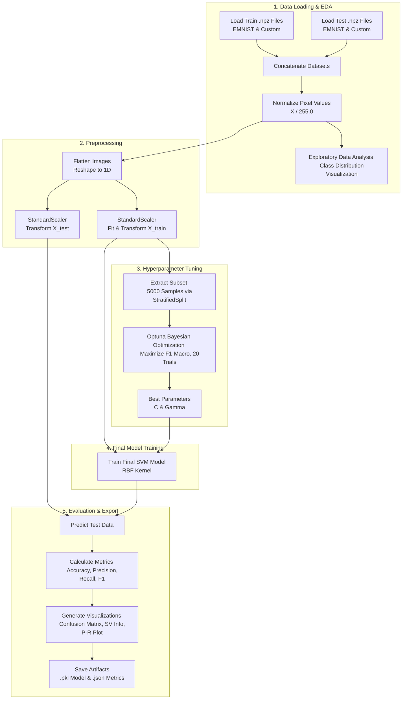

# Dokumentasi Pipeline SVM + Bayesian Optimization

Dokumen ini menguraikan arsitektur sistem, strategi pemrosesan data, desain model, hingga evaluasi akhir untuk **Klasifikasi Alfabet Huruf Kecil (a-z)**. Pendekatan komputasional yang diterapkan menggunakan **Support Vector Machine (SVM)** dengan optimasi hyperparameter berbasis **Bayesian Optimization**.

## Diagram Pipeline

Berikut adalah representasi visual dari arsitektur aliran data dari tahap input mentah hingga ekstraksi metrik evaluasi:



## Ringkasan Dataset & Strategi Penggabungan

Model ini dilatih menggunakan gabungan dua representasi data: dataset standar **EMNIST Lowercase** (yang telah diseimbangkan) dan **Dataset Custom Abjad**. Tujuan utama dalam tahap ini adalah mencegah **Data Leakage** (kebocoran informasi dari data uji ke data latih).

**Kutipan Kode: Ingesti dan Isolasi Data**

```python
def load_data():
    # Isolasi sumber file secara eksplisit
    train_files = ["emnist_lowercase_train_balanced.npz", "dataset_abjad_custom_train.npz"]
    test_files = ["emnist_lowercase_test_balanced.npz", "dataset_abjad_custom_test.npz"]

    def load_and_concat_npz(file_list, name):
        X_list, y_list = [], []
        for file in file_list:
            data = np.load(file)
            keys = data.files
            # Penanganan dinamis struktur NPZ
            if len(data[keys[0]].shape) > 1:
                X_raw, y_raw = data[keys[0]], data[keys[1]]
            else:
                X_raw, y_raw = data[keys[1]], data[keys[0]]
            X_list.append(X_raw)
            y_list.append(y_raw)
        return np.concatenate(X_list, axis=0), np.concatenate(y_list, axis=0)

    # Ingesti independen
    X_train_raw, y_train_raw = load_and_concat_npz(train_files, "TRAIN")
    X_test_raw, y_test_raw = load_and_concat_npz(test_files, "TEST")

    # Normalisasi tipe data dan skala piksel [0, 1]
    X_train = X_train_raw.astype(np.float32) / 255.0
    X_test = X_test_raw.astype(np.float32) / 255.0
    y_train = y_train_raw.astype(np.int64)
    y_test = y_test_raw.astype(np.int64)

    return X_train, X_test, y_train, y_test

```

### Statistik Distribusi Dataset

| Metrik             | Nilai                                 |
| ------------------ | ------------------------------------- |
| Total Kelas        | 26 (a-z)                              |
| Total Sampel Train | Dihitung dari gabungan file           |
| Total Sampel Test  | Dihitung dari gabungan file           |
| Tipe Data          | float32 (normalisasi) / int64 (label) |

---

## Preprocessing & Pembersihan Data Lanjutan

Tahap prapemrosesan krusial untuk algoritma berbasis jarak/margin seperti SVM. Alur prapemrosesan mencakup **Flattening Transform** (meratakan citra multi-dimensi menjadi vektor satu dimensi) dan **Feature Standardization** (menyesuaikan distribusi fitur agar memiliki rata-rata nol dan variansi unit).

**Kutipan Kode: Transformasi Dimensionalitas dan Standarisasi**

```python
def preprocess(X_train, X_test):
    # Flattening: Meratakan dimensi spasial citra menjadi representasi vektor 1D
    if len(X_train.shape) > 2:
        X_train = X_train.reshape(X_train.shape[0], -1)
        X_test = X_test.reshape(X_test.shape[0], -1)

    # Standarisasi fitur berdasar distribusi data latih
    scaler = StandardScaler()
    X_train_scaled = scaler.fit_transform(X_train)
    X_test_scaled = scaler.transform(X_test) # Transform only (No Leakage)

    return X_train_scaled, X_test_scaled, scaler

```

---

## Arsitektur Model & Alur Pelatihan

Algoritma pembelajaran diawasi yang digunakan adalah **Support Vector Classification (SVC)** dengan ekstensi fitur non-linear menggunakan **Radial Basis Function (RBF) Kernel**. Karena sensitivitas SVM terhadap hiperparameter, pencarian nilai optimal dilakukan melalui pendekatan probabilistik **Bayesian Optimization** (menggunakan _Optuna_).

Untuk menghindari _bottleneck_ komputasi saat _tuning_, digunakan fungsi `StratifiedShuffleSplit` guna mengekstraksi subset representatif sebanyak 5.000 sampel yang mempertahankan proporsi seimbang (_balanced distribution_) dari 26 kelas.

### Tabel Parameter Hyperparameter dan Ruang Pencarian

| Komponen / Modul  | Parameter Konfigurasi | Nilai / Ruang Pencarian (_Search Space_) | Deskripsi Fungsional Akademis                                                                |
| ----------------- | --------------------- | ---------------------------------------- | -------------------------------------------------------------------------------------------- |
| **Optuna Tuner**  | `n_trials`            | 20 Iterasi                               | Jumlah percobaan sampling algoritma TPE (_Tree-structured Parzen Estimator_).                |
| **Optuna Tuner**  | `cv`                  | 3 Fold                                   | _Cross-Validation_ stratifikasi, meminimalisir varians pada estimasi metrik.                 |
| **Optuna Tuner**  | `sampler`             | TPESampler(seed=42)                      | Algoritma optimasi Bayesian untuk eksplorasi efisien ruang hiperparameter.                   |
| **SVC Algorithm** | `kernel`              | `'rbf'`                                  | Mentransformasi fitur ke ruang dimensi lebih tinggi untuk memisahkan data non-linear.        |
| **SVC Algorithm** | `C` (Regularisasi)    | Log-uniform `[1e-2, 1e2]`                | Mengatur _trade-off_ antara margin klasifikasi yang luas vs penalti misklasifikasi.          |
| **SVC Algorithm** | `gamma` (Kernel Coef) | Log-uniform `[1e-4, 1e0]`                | Mengontrol radius pengaruh (_influence radius_) dari titik _support vector_.                 |
| **SVC Algorithm** | `max_iter`            | 2000 (Tune) / 3000 (Final)               | Ambang batas maksimal konvergensi solver untuk _hard-stop_ komputasi matriks yang persisten. |
| **Random State**  | `SEED`                | 42                                       | Reproduksibilitas penuh seluruh komponen stokastik.                                          |

**Kutipan Kode: Optimasi Bayesian dan Fit Final**

```python
# 1. Definisi Fungsi Objektif Optuna
def svm_objective(trial, X_sub, y_sub):
    # Eksplorasi hyperparameter di ruang logaritmik
    C = trial.suggest_float("C", 1e-2, 1e2, log=True)
    gamma = trial.suggest_float("gamma", 1e-4, 1e0, log=True)

    model = SVC(kernel="rbf", C=C, gamma=gamma, max_iter=2000, random_state=SEED)
    # Validasi silang untuk mencegah overfitting saat tuning
    score = cross_val_score(model, X_sub, y_sub, cv=3, scoring="f1_macro", n_jobs=-1).mean()
    return score

# 2. Inisiasi Pencarian
def tune_svm(X_train_scaled, y_train):
    subset_size = min(SVM_TUNING_SUBSET, len(X_train_scaled))  # 5000 sampel
    sss = StratifiedShuffleSplit(n_splits=1, train_size=subset_size, random_state=SEED)
    idx_sub, _ = next(sss.split(X_train_scaled, y_train))
    X_sub, y_sub = X_train_scaled[idx_sub], y_train[idx_sub]

    study = optuna.create_study(direction="maximize", sampler=optuna.samplers.TPESampler(seed=SEED))
    study.optimize(lambda trial: svm_objective(trial, X_sub, y_sub), n_trials=N_TRIALS_SVM)  # 20 trials
    return study.best_params

best_params = tune_svm(X_train_scaled, y_train)

# 3. Pelatihan Final pada Keseluruhan Data
model = SVC(
    kernel="rbf",
    C=best_params["C"],
    gamma=best_params["gamma"],
    max_iter=MAX_ITER_FINAL,  # 3000 iterasi
    random_state=SEED
)
model.fit(X_train_scaled, y_train)

```

---

## Metrik Evaluasi

Kinerja arsitektur dievaluasi tidak hanya berdasar indikator tunggal, melainkan matriks kinerja multivariabel. Karena dataset dikondisikan relatif seimbang, pendekatan `macro average` digunakan untuk mengevaluasi kapabilitas model mengenali karakteristik unik setiap kelas huruf.

Metrik utama yang digunakan:

1. **Accuracy**: Rasio kebenaran prediksi total.
2. **Macro Precision**: Presisi agnostik-kelas (memastikan label positif prediksi tidak terkontaminasi _False Positives_).
3. **Macro Recall**: Sensitivitas agnostik-kelas (memastikan model tidak kehilangan observasi sampel kelas yang seharusnya _True Positives_).
4. **Macro F1-Score**: Rata-rata harmonik ideal dari Precision dan Recall.

Selain metrik matematis, analisis kesalahan komprehensif dilakukan menggunakan iterasi visual **Confusion Matrix** dan deteksi anomali pada kelas dengan akurasi pengenalan (_recognition rate_) di bawah standar threshold empiris (80%).

**Kutipan Kode: Ekstraksi Kinerja Inferensi**

```python
# Pelaksanaan inferensi pada set pengujian tak-terlihat (unseen set)
y_pred = model.predict(X_test_scaled)

# Perhitungan Metrik Inferensial
acc = accuracy_score(y_test, y_pred)
prec = precision_score(y_test, y_pred, average='macro', zero_division=0)
rec = recall_score(y_test, y_pred, average='macro', zero_division=0)
f1 = f1_score(y_test, y_pred, average='macro')

print(f"Accuracy  : {acc:.4f} ({acc*100:.2f}%)")
print(f"Precision : {prec:.4f}")
print(f"Recall    : {rec:.4f}")
print(f"F1-Score  : {f1:.4f}")

# Pembangkitan Laporan Akademis per Kelas
print(classification_report(y_test, y_pred, target_names=LABELS, zero_division=0))

# Penyimpanan Artifak Serialisasi Model (Siap Deployment)
model_data = {
    "model": model,
    "scaler": scaler,
    "metrics": {"accuracy": acc, "precision": prec, "recall": rec, "f1": f1},
    "class_labels": LABELS
}
joblib.dump(model_data, "svm_model_balanced.pkl")

# Penyimpanan metrik ke JSON untuk perbandingan antar model
with open('svm_metrics.json', 'w') as f:
    json.dump(svm_metrics, f, indent=2)

```

---

## Analisis Support Vectors

Support Vector Machine memiliki karakteristik unik berupa **Support Vectors** (vektor pendukung) yang mendefinisikan _decision boundary_. Analisis proporsi dan distribusi support vectors memberikan wawasan tentang kompleksitas model dan potensi overfitting.

### Komponen Analisis Support Vectors:

| Komponen                    | Deskripsi                                                                                                 |
| --------------------------- | --------------------------------------------------------------------------------------------------------- |
| **Total Support Vectors**   | Jumlah total vektor yang menjadi penentu margin keputusan                                                 |
| **Rasio SV / Total Data**   | Proporsi data latih yang menjadi support vectors (semakin kecil mengindikasikan margin yang lebih bersih) |
| **Distribusi SV per Kelas** | Visualisasi jumlah support vectors untuk masing-masing dari 26 kelas                                      |

**Kutipan Kode: Analisis Support Vectors**

```python
def plot_svm_info(model, X_train_scaled, y_train):
    n_support = model.n_support_
    support_vectors = model.support_vectors_
    n_total = len(X_train_scaled)

    # Mengekstrak support vectors per kelas bawaan atribut model SVC
    support_per_class = np.array(model.n_support_)

    print(f"Total data training    : {n_total:,}")
    print(f"Total support vectors  : {len(support_vectors):,} ({len(support_vectors)/n_total*100:.2f}%)")
    print(f"Rata-rata SV per kelas : {np.mean(support_per_class):.0f}")

```

---

## Analisis Precision-Recall per Kelas

Selain akurasi per kelas, analisis mendalam dilakukan terhadap **Precision** dan **Recall** individual setiap kelas untuk mengidentifikasi jenis kesalahan spesifik yang dilakukan model.

### Interpretasi Metrik per Kelas:

| Skenario                            | Interpretasi                                                                                               |
| ----------------------------------- | ---------------------------------------------------------------------------------------------------------- |
| **Precision rendah, Recall tinggi** | Model menghasilkan banyak _False Positives_ (sering salah mengklasifikasikan huruf lain sebagai kelas ini) |
| **Precision tinggi, Recall rendah** | Model menghasilkan banyak _False Negatives_ (sering gagal mengenali kelas ini)                             |
| **Keduanya rendah**                 | Model kesulitan membedakan kelas ini dengan kelas lain secara signifikan                                   |

**Kutipan Kode: Visualisasi Precision-Recall**

```python
def plot_precision_recall_per_class(y_true, y_pred):
    precision, recall, f1, support = precision_recall_fscore_support(
        y_true, y_pred, zero_division=0
    )

    # Scatter plot Precision vs Recall dengan warna F1-Score
    # dan grouped bar chart untuk perbandingan langsung

```

---

## Visualisasi Output yang Dihasilkan

Pipeline ini menghasilkan berbagai artefak visual untuk analisis komprehensif:

| Nama File                            | Deskripsi                                         |
| ------------------------------------ | ------------------------------------------------- |
| `svm_visual_breakdown.png`           | Distribusi kelas train vs test dengan persentase  |
| `svm_confusion_matrix.png`           | Confusion matrix heatmap dengan anotasi jumlah    |
| `svm_per_class_accuracy.png`         | Bar chart akurasi per kelas dengan threshold 80%  |
| `svm_model_info.png`                 | Informasi support vectors (pie chart + bar chart) |
| `svm_precision_recall_per_class.png` | Scatter plot P vs R dan grouped bar chart         |

---

## Parameter Konfigurasi Global

```python
SEED = 42                      # Reproduksibilitas
SVM_TUNING_SUBSET = 5000       # Subset untuk tuning
N_TRIALS_SVM = 20              # Jumlah trial Optuna
MAX_ITER_FINAL = 3000          # Max iter untuk training final
LABELS = [chr(i + ord('a')) for i in range(26)]  # a-z

```

---

## Ringkasan Alur Eksekusi

1. **Import Library** - scikit-learn, optuna, matplotlib, seaborn, joblib
2. **Load Data** - Gabungkan EMNIST + Custom dataset (terpisah train/test)
3. **Preprocessing** - Normalisasi [0,1] → Flatten 784 → StandardScaler
4. **Hyperparameter Tuning** - Optuna (20 trials, 3-fold CV, F1 macro)
5. **Training Final** - SVM RBF dengan parameter terbaik (max_iter=3000)
6. **Evaluasi** - Prediksi test set, hitung metrik makro
7. **Visualisasi** - Confusion matrix dan akurasi per kelas
8. **Analisis Support Vectors** - Proporsi dan distribusi SV
9. **Analisis Precision-Recall** - Identifikasi kelas bermasalah
10. **Deployment Artifacts** - Simpan model (.pkl) dan metrik (.json)
