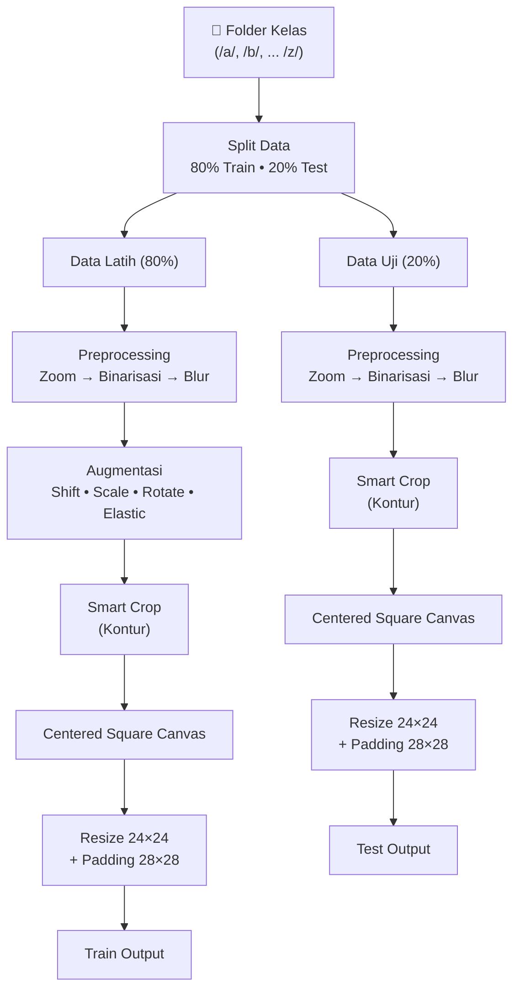

````markdown
# Dokumentasi Pipeline Preprocessing, Augmentasi, & Splitting Dataset Alfabet Huruf Kecil

Dokumen ini menjelaskan alur kerja (_pipeline_) pra-pemrosesan gambar (Computer Vision) untuk mengonversi gambar mentah tulisan tangan abjad (a-z) menjadi dataset _array multi-dimensi_ berformat biner (`.npz`) yang sangat efisien dan siap disuntikkan ke dalam model Machine Learning atau Deep Learning.

Pipeline ini dirancang mengikuti pedoman ekstraksi presisi dari dataset EMNIST/NIST, diperkaya dengan taktik **Data Augmentation** berlandaskan riset pengenalan karakter tulisan tangan, dan mengimplementasikan **pemisahan data (Split 80:20) sejak awal** untuk mencegah kebocoran data (_Data Leakage_).

## 📌 Prasyarat Sistem

Pastikan pustaka Python berikut telah terinstal di lingkungan virtual:

```bash
pip install opencv-python numpy pandas matplotlib albumentations
```
````

## 📁 Struktur Direktori

Skrip mengharapkan struktur direktori input sebagai berikut:

```text
dataset_original/
├── a/
│   ├── img_001.png
│   ├── img_002.jpg
│   └── ... (Total N gambar)
└── ...

```

**Output Akhir:**

1. File tunggal `dataset_abjad_custom.npz` (NumPy Zipped Archive yang memuat array Latih dan Uji secara terkompresi).
2. 5 file `sampel_fase_*.png` (Grid komparasi evolusi 26 huruf).
3. File `komparasi_augmentasi_*.png` (Visualisasi komparasi geometri spasial dari hasil augmentasi).

---

## ⚙️ Diagram Arsitektur Pipeline

Untuk menjamin validitas evaluasi model, gambar dipisah menjadi set Latih (80%) dan Uji (20%) _sebelum_ tahap augmentasi. Hal ini memastikan model diuji menggunakan gambar murni yang belum pernah dilihat atau dimodifikasi sebelumnya.



---

## 🔬 Detail Eksekusi per Fase

### Fase Pra-0: Evaluasi Rasio & Splitting

Sebelum gambar dimanipulasi, skrip menghitung total populasi gambar di dalam folder kelas dan memotongnya tepat di rasio 80% Latih dan 20% Uji.

- **Keterangan:** Mencegah gambar asli masuk ke data Test, sementara versi augmentasinya (rotasi/geser) masuk ke data Train yang dapat membuat model sekadar "menghafal" (Overfitting) alih-alih belajar mengenali pola general.

### Fase 0: Zoom In

Membuang _noise_ ujung kanvas (bayangan/bingkai kamera) agar tidak mengacaukan perhitungan threshold.

```python
zoom_percent = 0.24
h, w = img.shape
y_crop1, y_crop2 = int(h * zoom_percent), int(h * (1 - zoom_percent))
x_crop1, x_crop2 = int(w * zoom_percent), int(w * (1 - zoom_percent))
img = img[y_crop1:y_crop2, x_crop1:x_crop2]

```

- **Keterangan:** Memotong 24% area terluar dari keempat sisi gambar.

### Fase 1: Binarisasi & Pembalikan Warna (Invert)

Memaksa latar belakang menjadi hitam (0) dan coretan tinta menjadi putih (255) secara otomatis.

```python
_, binary = cv2.threshold(img, 0, 255, cv2.THRESH_BINARY_INV + cv2.THRESH_OTSU)

```

- **Keterangan:** Algoritma kontur OpenCV mewajibkan objek berwarna putih di atas latar belakang hitam. Otsu's Thresholding mencari nilai batas paling optimal berdasarkan histogram ketebalan tinta.

### Fase 2: Gaussian Blur (Penghalusan)

Menghaluskan tepian coretan huruf yang bergerigi (_anti-aliasing_).

```python
blurred = cv2.GaussianBlur(binary, (0, 0), sigmaX=1.3, sigmaY=1.3)

```

- **Keterangan:** Menggunakan nilai sigma 1.3 untuk meratakan piksel-piksel kasar tanpa menghilangkan detail utama lekukan.

### Fase 3: Augmentasi Geometri Spasial (Eksklusif untuk Data Latih)

Menciptakan 5 variasi buatan dari 1 gambar asli untuk memperkaya distribusi data pelatihan (Multiplier 6x). Teknik augmentasi diterapkan pada gambar utuh (_full frame_) sebelum di-crop agar tulisan tidak terpotong saat bergeser atau berputar. **Fase ini diabaikan sepenuhnya untuk Data Uji (Test).**

| Nama Fungsi                | Deskripsi Fungsi                                                                                                                             | Rentang Perubahan (Parameter)                                                                                                                                                               |
| -------------------------- | -------------------------------------------------------------------------------------------------------------------------------------------- | ------------------------------------------------------------------------------------------------------------------------------------------------------------------------------------------- |
| **`A.Affine` (Scale)**     | Mengecilkan ukuran (_downscaling_) karakter secara acak untuk melatih model mengenali berbagai ukuran tulisan tangan manusia di dunia nyata. | **`0.75` hingga `1.0`** <br><br>Ukuran karakter bisa menyusut hingga maksimal **75%** dari ukuran aslinya. Fitur perbesaran (_upscaling_) dimatikan agar huruf tidak melampaui batas layar. |
| **`A.Affine` (Translate)** | Menggeser posisi huruf secara horizontal (kiri/kanan) dan vertikal (atas/bawah) di dalam kanvas untuk meniru variasi letak sentralisasi.     | X: **`0.0` s/d `0.05`** <br><br>Y: **`-0.02` s/d `0.02`** <br><br>Posisi huruf bisa bergeser maksimal **5%** secara horizontal dan **2%** secara vertikal.                                  |
| **`A.Affine` (Rotate)**    | Memutar matriks gambar untuk mensimulasikan kemiringan posisi kertas saat difoto atau dipindai.                                              | **`-1.5°` hingga `1.5°`** <br><br>Kemiringan putaran dibatasi sangat sempit (maksimal **1.5 derajat**) untuk menghindari kerusakan bentuk huruf akibat _extreme rescaling_.                 |
| **`A.Affine` (Shear)**     | Menarik sudut gambar untuk menciptakan efek tulisan tegak bersambung, miring (_italic_), atau condong.                                       | **`-15°` hingga `15°`** <br><br>Sumbu gambar bisa dimiringkan hingga maksimal **15 derajat** ke kiri atau ke kanan.                                                                         |
| **`A.ElasticTransform`**   | Mengacak piksel internal secara non-linear (bergelombang) untuk meniru ketidakstabilan otot tangan manusia saat menulis aksara melengkung.   | **`alpha=20`, `sigma=5`** <br><br>Intensitas distorsi gelombang dikunci pada nilai **20** dengan tingkat kehalusan **5** agar bentuk huruf tetap terbaca.                                   |

### Fase 4: Smart Crop (Ekstraksi Region of Interest / ROI)

Membuang seluruh ruang kosong hitam sehingga kanvas dipotong menempel ketat pada ujung coretan huruf.

```python
contours, _ = cv2.findContours(blurred_image, cv2.RETR_EXTERNAL, cv2.CHAIN_APPROX_SIMPLE)
# ... [mencari x_min, y_min, x_max, y_max dari semua bounding box kontur] ...
roi = blurred_image[y_min:y_max, x_min:x_max]

```

- **Keterangan:** Mencegah proporsi huruf rusak saat standardisasi ukuran akibat posisi menulis yang tidak tepat di tengah foto.

### Fase 5: Centered Square Canvas (Preservasi Rasio Aspek)

Menghindari distorsi proporsi (huruf menjadi "gepeng" atau "melar").

```python
h_roi, w_roi = roi.shape
max_dim = max(h_roi, w_roi)
square_canvas = np.zeros((max_dim, max_dim), dtype=np.uint8)

y_offset = (max_dim - h_roi) // 2
x_offset = (max_dim - w_roi) // 2
square_canvas[y_offset:y_offset+h_roi, x_offset:x_offset+w_roi] = roi

```

- **Keterangan:** Mengevaluasi sisi terpanjang gambar ROI, membuat kanvas persegi baru dengan dimensi tersebut, lalu meletakkan huruf persis di koordinat tengahnya.

### Fase 6: Resize, Padding, Normalize & (Opsional) Flattening

Standardisasi piksel akhir agar sesuai dengan _input layer_ Machine Learning.

```python
# 1. Bi-Cubic Resize (Mengecilkan ke 24x24)
resized_24 = cv2.resize(square_canvas, (24, 24), interpolation=cv2.INTER_CUBIC)

# 2. Border Padding (Memberi ruang nafas 2px di tiap sisi -> total 28x28)
final_28 = cv2.copyMakeBorder(resized_24, 2, 2, 2, 2, cv2.BORDER_CONSTANT, value=0)

# 3. Normalisasi (Memastikan piksel ada di rentang 0-255 murni)
final_28 = cv2.normalize(final_28, None, alpha=0, beta=255, norm_type=cv2.NORM_MINMAX, dtype=cv2.CV_8U)

# 4. Flattening Opsional (Jika ingin dibuat 1D array berukuran 784 untuk SVM)
features_1d = final_28.flatten()

```

---

## 📊 Format Ekspor NPZ (NumPy Zipped Archive)

Alih-alih menggunakan `.csv` yang lambat dan boros memori, pipeline ini mengekspor data ke format `.npz` menggunakan fungsi `np.savez_compressed()`. Format ini mempertahankan struktur array asli secara biner, membuat waktu _loading_ data ribuan kali lebih cepat dengan ukuran file yang jauh lebih kecil.

File `dataset_abjad_custom.npz` berisi 4 struktur _key_ (_Dictionary-like_):

| Kunci (Key) | Shape Array Asumsi (Opsional 1D/2D) | Tipe Data           | Deskripsi                                                                 |
| ----------- | ----------------------------------- | ------------------- | ------------------------------------------------------------------------- |
| `X_train`   | `(6240, 784)` atau `(6240, 28, 28)` | `float32` / `uint8` | Matriks fitur gambar untuk data pelatihan (Data Asli + Hasil Augmentasi). |
| `y_train`   | `(6240,)`                           | `int64`             | Label target data latih (0 untuk 'a', ..., 25 untuk 'z').                 |
| `X_test`    | `(260, 784)` atau `(260, 28, 28)`   | `float32` / `uint8` | Matriks fitur gambar murni untuk pengujian model (HANYA Data Asli).       |
| `y_test`    | `(260,)`                            | `int64`             | Label target data uji.                                                    |

**Statistik Populasi Output:**

```text
 Total Train (Asli + Augmentasi) : ~6.240 Citra (Shape: Nx784)
 Total Test  (Hanya Asli Murni)  : ~260 Citra   (Shape: Nx784)
 Diekspor ke: dataset_abjad_custom.npz

```

**Contoh Cara Memuat (Loading) Dataset NPZ:**

```python
import numpy as np

# Memuat data dalam 1 detik (sangat ringan di RAM)
data = np.load('dataset_abjad_custom.npz')

X_train = data['X_train']
y_train = data['y_train']
X_test = data['X_test']
y_test = data['y_test']

```
