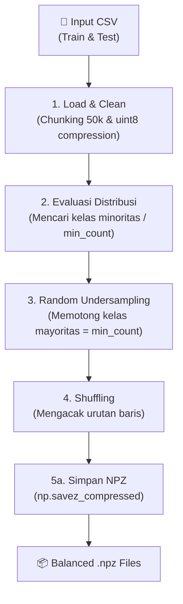

````markdown
# Dokumentasi Pipeline Undersampling & Konversi NPZ Dataset EMNIST

Dokumen ini menjelaskan _pipeline_ pra-pemrosesan data untuk menangani masalah ketidakseimbangan kelas (_Class Imbalance_) yang parah pada dataset EMNIST _Lowercase_.

Skrip ini mengimplementasikan teknik **Random Undersampling** untuk menyeimbangkan jumlah sampel antar abjad (a-z), mengacak urutan data (_shuffling_), dan mengekspornya ke dalam format biner terkompresi (`.npz`) untuk mempercepat waktu pemuatan (_loading time_) pada tahap pelatihan model.

## 📌 Prasyarat Sistem

Pastikan pustaka Python berikut telah terinstal:

```bash
pip install pandas numpy matplotlib
```
````

## 📁 Alur File (Input & Output)

**Input:**

- `emnist_lowercase_train.csv` (Dataset Latih Mentah)
- `emnist_lowercase_test.csv` (Dataset Uji Mentah)

**Output:**

- `emnist_lowercase_train_balanced.npz` (Dataset Latih Seimbang & Ringan)
- `emnist_lowercase_test_balanced.npz` (Dataset Uji Seimbang & Ringan)
- `distribusi_sebelum_sesudah.png` (Grafik visualisasi komparasi)

---

## ⚙️ Diagram Pipeline



---

## 🔬 Detail Penjelasan per Tahap

### Tahap 1: Pemuatan Data Aman (Memory-Safe Loading)

Membaca dataset CSV yang berukuran sangat besar berisiko menyebabkan _Out of Memory_ (RAM penuh) atau _crash_ jika terdapat _header_ ganda yang terselip.

- **Teknik Chunking:** File dibaca per 50.000 baris (`chunksize=50000`).
- **Pembersihan Instan:** Baris _header_ ganda (`'label' == 'label'`) dibuang pada saat _chunk_ diproses.
- **Kompresi Tipe Data:** Seluruh matriks piksel dikonversi ke `np.uint8` (1 byte per piksel) dari yang awalnya _float64_ (8 byte), menghemat penggunaan RAM hingga 80%.

```python
chunk_iterator = pd.read_csv(file_path, chunksize=50000, low_memory=False)
for chunk in chunk_iterator:
    chunk_clean = chunk[chunk['label'] != 'label'].copy()
    chunk_clean = chunk_clean.astype(np.uint8)

```

### Tahap 2: Random Undersampling & Shuffling

Dataset EMNIST memiliki distribusi hukum Zipf (huruf vokal sangat banyak, huruf konsonan jarang). Tahap ini meratakan lapangan bermain agar model Machine Learning tidak bias (_overfitting_) ke huruf mayoritas.

- **Deteksi Minoritas:** Mencari kelas dengan jumlah sampel paling sedikit (`min_count`).
- **Undersampling:** Mengambil sampel acak dari setiap kelas sebanyak `min_count` membuang sisa data kelas mayoritas.
- **Shuffling:** Data diacak urutannya (`frac=1`) agar model tidak belajar berdasarkan urutan kelas (misal: belajar seluruh huruf 'a' dulu, baru 'b').

```python
# Random Undersampling
df_balanced = df.groupby('label').sample(n=min_count, random_state=42)

# Mengacak ulang (shuffling)
df_balanced = df_balanced.sample(frac=1, random_state=42).reset_index(drop=True)

```

### Tahap 3: Ekspor ke Format NPZ (NumPy Zipped)

Mengonversi format _tabular_ (Dataframe) kembali menjadi matriks fitur NumPy (`X`) dan label (`y`), lalu mengemasnya dalam arsip biner.

- **Efisiensi Waktu:** Membaca file `.npz` hanya membutuhkan waktu 1-3 detik, dibandingkan memuat `.csv` yang memakan waktu bermenit-menit.

```python
y = df['label'].to_numpy(dtype=np.int32)
X = df.drop('label', axis=1).to_numpy(dtype=np.uint8)
np.savez_compressed(output_filename, images=X, labels=y)

```

### Tahap 4: Visualisasi Komparasi (Before - After)

Fungsi `plot_distributions` memproduksi bagan batang bertumpuk (_stacked bar chart_) untuk membuktikan bahwa proses _undersampling_ berhasil dilakukan.

- **Grafik Atas (Before):** Menunjukkan ketimpangan ekstrem antara kelas mayoritas dan minoritas.
- **Grafik Bawah (After):** Menunjukkan distribusi data yang sudah 100% sejajar (rata) untuk seluruh 26 kelas, lengkap dengan pembagian warna biru untuk _Train_ dan arsiran hijau untuk _Test_.

---

## 📊 Format Ekspor NPZ (NumPy Zipped Archive)

Cara memuat (_load_) data di _notebook_ pelatihan (Training Notebook) Anda selanjutnya:

```python
import numpy as np

# Memuat data
train_data = np.load('emnist_lowercase_train_balanced.npz')
test_data = np.load('emnist_lowercase_test_balanced.npz')

# Ekstraksi Fitur dan Label
X_train = train_data['images'] / 255.0 # Langsung normalisasi
y_train = train_data['labels']

X_test = test_data['images'] / 255.0
y_test = test_data['labels']

print(f"Data latih siap: {X_train.shape}")

```
